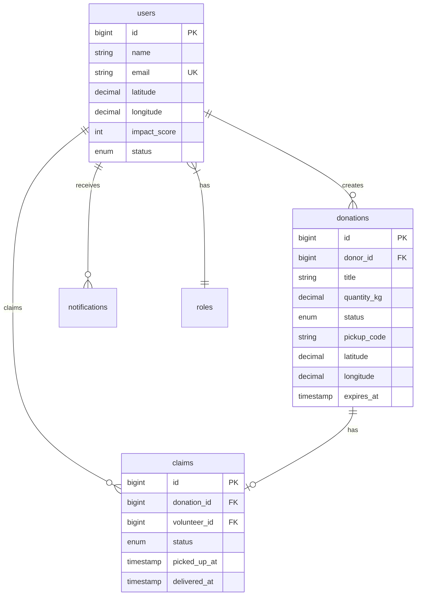

<div align="center">

<!-- HERO SECTION -->


# 🍽️ ZeroHunger

### **Connecting Surplus to Need. One Meal at a Time.**

_A full-stack food recovery platform that transforms waste into hope—bridging the gap between those with too much and those with too little._

<br/>

<!-- BADGES -->

[](https://nextjs.org/)
[](https://react.dev/)
[](https://www.typescriptlang.org/)
[](https://laravel.com/)
[](https://www.php.net/)
[](https://www.mysql.com/)

[](https://tailwindcss.com/)
[](https://ui.shadcn.com/)
[](https://www.framer.com/motion/)
[](https://tanstack.com/query/)

[](LICENSE)
[](CONTRIBUTING.md)
[]()

<br/>

[🌐 Live Demo](#) · [📖 Documentation](#-documentation) · [🚀 Quick Start](#-getting-started) · [🗺️ Roadmap](#-project-roadmap)

---

<br/>


</div>

---

## 🌍 The Vision: Why ZeroHunger?

> **"Every year, 1.3 billion tons of food is wasted globally—while 828 million people go hungry."**  
> _— United Nations Food and Agriculture Organization_

We refuse to accept this paradox as inevitable.

**ZeroHunger** is not just an application—it's a **movement**. A technological bridge that connects:

|                  🏪 **Surplus Holders**                  |               🚗 **Volunteers**                |                   🙏 **Those in Need**                    |
| :------------------------------------------------------: | :--------------------------------------------: | :-------------------------------------------------------: |
| Restaurants, bakeries, and supermarkets with excess food | Community members with vehicles and compassion | Shelters, food banks, and families facing food insecurity |

### The Problem We Solve

```
┌─────────────────────────────────────────────────────────────────────────────┐
│                                                                             │
│   🍞 Restaurant closes with 50kg unsold food                                │
│                     ↓                                                       │
│   ❌ BEFORE: Food goes to dumpster → Methane emissions → Hunger continues   │
│                                                                             │
│   ✅ AFTER:  Food posted on ZeroHunger → Volunteer claims → Shelter receives│
│              Lives fed. Waste eliminated. Community empowered.              │
│                                                                             │
└─────────────────────────────────────────────────────────────────────────────┘
```

**Every donation creates a ripple effect:**

- 🌱 **Environmental Impact:** Less food in landfills = reduced methane emissions
- 💚 **Human Impact:** Nutritious meals reach those who need them most
- 🏆 **Community Impact:** Gamified impact scores inspire ongoing participation

---

## ✨ Key Features

<div align="center">


</div>

### 🔐 Role-Based Authentication & Access Control

- **Secure JWT Authentication** via Laravel Sanctum
- **Three User Roles:** Donor, Volunteer, Recipient
- **Granular Permissions:** Role-specific dashboards and workflows
- **Protected Routes:** Middleware-level security with automatic redirects

### 🗺️ Real-Time Geolocation & Interactive Maps

- **Browser Geolocation API** for automatic location detection
- **Interactive Leaflet Maps** with OpenStreetMap tiles
- **Proximity Filtering:** 5km, 10km, 25km, 50km radius search
- **Visual Markers:** Color-coded by donation status
- **Click-to-Set Location:** Intuitive donation placement

### 🎁 Complete Donation Lifecycle Management

- **Create → Claim → Pickup → Deliver** workflow
- **Secure Pickup Codes:** 6-digit verification prevents fraud
- **Real-Time Status Updates:** Track every step
- **Expiry Management:** Automatic status handling

### 🚚 Volunteer Claim Workflow

- **Race-Condition Protection:** Database-level locks prevent duplicate claims
- **Two-Step Verification:** Pickup code + Delivery confirmation
- **Impact Multiplier:** 2x points for completed deliveries
- **Claim Cancellation:** Graceful handling returns donations to pool

### 🔔 Intelligent Notification System

- **In-App Notifications:** Real-time updates in notification center
- **Toast Feedback:** Instant visual confirmation
- **Animated Bell Icon:** Shake effect on new notifications
- **Glassmorphic UI:** Modern, elegant dropdown design

### 🏆 Gamification & Impact Tracking

- **Impact Scores:** Points for every donation and delivery
- **Visual Badges:** Achievement-based recognition
- **Leaderboard Ready:** Architecture supports community ranking
- **Statistics Dashboard:** Track personal contribution metrics

### 🎨 Premium UI/UX

- **Framer Motion Animations:** Smooth page transitions and micro-interactions
- **Dark Mode Support:** System preference detection
- **Responsive Design:** Mobile-first with tablet and desktop optimization
- **Accessibility First:** ARIA compliance, keyboard navigation, reduced motion support

---

## 🏗️ Architecture: The Full-Stack Synergy

<div align="center">


</div>

This monorepo unifies **two powerful systems** into one cohesive platform:

```
┌─────────────────────────────────────────────────────────────────────────────┐
│                          ZeroHunger Monorepo                                │
├─────────────────────────────────┬───────────────────────────────────────────┤
│          FRONTEND               │              BACKEND (API)                │
│       ./front-end/              │           ./zerohunger-api/               │
├─────────────────────────────────┼───────────────────────────────────────────┤
│                                 │                                           │
│  ┌──────────────────────────┐   │   ┌───────────────────────────────────┐   │
│  │     Next.js 16 App       │   │   │      Laravel 12 API               │   │
│  │   (React 19 + Turbopack) │◄──┼──►│   (PHP 8.2 + Sanctum)            │   │
│  └──────────────────────────┘   │   └───────────────────────────────────┘   │
│              │                  │                  │                        │
│              ▼                  │                  ▼                        │
│  ┌──────────────────────────┐   │   ┌───────────────────────────────────┐   │
│  │   TanStack Query v5      │   │   │     MySQL 8.0 Database            │   │
│  │   (Server State Cache)   │   │   │   (utf8mb4, InnoDB)               │   │
│  └──────────────────────────┘   │   └───────────────────────────────────┘   │
│              │                  │                  │                        │
│              ▼                  │                  ▼                        │
│  ┌──────────────────────────┐   │   ┌───────────────────────────────────┐   │
│  │   Axios + Interceptors   │   │   │   Spatie Permissions + RBAC       │   │
│  │   (Token Management)     │   │   │   (Role-Based Access Control)     │   │
│  └──────────────────────────┘   │   └───────────────────────────────────┘   │
│                                 │                                           │
└─────────────────────────────────┴───────────────────────────────────────────┘
```

### Technology Stack Comparison

<table>
<tr>
<th width="50%">🎨 Frontend Stack</th>
<th width="50%">⚙️ Backend Stack</th>
</tr>
<tr>
<td>

| Technology          | Version | Purpose                    |
| :------------------ | :-----: | :------------------------- |
| **Next.js**         |   16    | App Router, RSC, Turbopack |
| **React**           |   19    | UI Component Architecture  |
| **TypeScript**      |   5.x   | Type Safety & DX           |
| **Tailwind CSS**    |   v4    | Utility-First Styling      |
| **Shadcn UI**       | Latest  | Accessible Components      |
| **Framer Motion**   |   12    | Animations                 |
| **TanStack Query**  |   v5    | Server State               |
| **React Hook Form** |   7.x   | Form Management            |
| **Zod**             |   4.x   | Schema Validation          |
| **React-Leaflet**   |   5.x   | Interactive Maps           |
| **Axios**           |   1.x   | HTTP Client                |
| **Lucide React**    | Latest  | Icon Library               |

</td>
<td>

| Technology            | Version | Purpose              |
| :-------------------- | :-----: | :------------------- |
| **Laravel**           |   12    | PHP Framework        |
| **PHP**               |  8.2+   | Server Language      |
| **MySQL**             |  8.0+   | Relational Database  |
| **Laravel Sanctum**   |   4.x   | API Authentication   |
| **Spatie Permission** |   6.x   | RBAC System          |
| **Eloquent ORM**      |    -    | Database Abstraction |
| **Laravel Queues**    |    -    | Background Jobs      |
| **Haversine Formula** |    -    | Geo Distance Calc    |
| **PHPUnit**           |   11    | Testing Framework    |
| **Vite**              |   7.x   | Asset Bundling       |

</td>
</tr>
</table>

### Data Flow Architecture

```
┌────────────────────────────────────────────────────────────────────────────┐
│                           REQUEST LIFECYCLE                                 │
└────────────────────────────────────────────────────────────────────────────┘

    User Action                API Request               Database
        │                          │                         │
        ▼                          ▼                         ▼
┌───────────────┐          ┌───────────────┐         ┌───────────────┐
│  React Component │ ───►   │  Axios Client  │ ───►   │  Laravel API   │
│  (onClick)       │        │  (Bearer Token)│        │  (Controller)  │
└───────────────┘          └───────────────┘         └───────────────┘
        │                          │                         │
        ▼                          ▼                         ▼
┌───────────────┐          ┌───────────────┐         ┌───────────────┐
│  TanStack Query │ ◄───   │  JSON Response │ ◄───   │  Eloquent Model│
│  (Cache Update) │        │  (Typed Data)  │        │  (Query)       │
└───────────────┘          └───────────────┘         └───────────────┘
        │
        ▼
┌───────────────┐
│  UI Re-render  │
│  (Optimistic)  │
└───────────────┘
```

---

## 🗄️ Database Schema

The backend uses a **relational MySQL database** with the following core entities:



<details>
<summary>📋 <strong>View Complete Table Reference</strong></summary>

| Table                    | Purpose                       | Key Fields                                                        |
| :----------------------- | :---------------------------- | :---------------------------------------------------------------- |
| `users`                  | User accounts (all roles)     | `id`, `name`, `email`, `role`, `impact_score`, `lat/lng`          |
| `donations`              | Food donation listings        | `id`, `donor_id`, `title`, `quantity_kg`, `status`, `pickup_code` |
| `claims`                 | Volunteer claims on donations | `id`, `donation_id`, `volunteer_id`, `status`, `picked_up_at`     |
| `notifications`          | In-app notifications          | `id`, `user_id`, `type`, `data`, `read_at`                        |
| `roles`                  | Role definitions (Spatie)     | `id`, `name`, `guard_name`                                        |
| `permissions`            | Permission definitions        | `id`, `name`, `guard_name`                                        |
| `personal_access_tokens` | Sanctum API tokens            | `id`, `tokenable_id`, `token`, `abilities`                        |

**Donation Status Flow:**
`available` → `reserved` → `picked_up` → `delivered`

**Claim Status Flow:**
`active` → `picked_up` → `delivered` (or `cancelled`)

</details>

---

## 🚀 Getting Started

Follow these steps to run **both** the frontend and backend locally.

### Prerequisites

Ensure you have the following installed:

| Requirement  | Version | Download                                      |
| :----------- | :------ | :-------------------------------------------- |
| **Node.js**  | 18.18+  | [nodejs.org](https://nodejs.org/)             |
| **PNPM**     | 8.x+    | `npm install -g pnpm`                         |
| **PHP**      | 8.2+    | [php.net](https://www.php.net/downloads)      |
| **Composer** | 2.x     | [getcomposer.org](https://getcomposer.org/)   |
| **MySQL**    | 8.0+    | [mysql.com](https://dev.mysql.com/downloads/) |
| **Git**      | Latest  | [git-scm.com](https://git-scm.com/)           |

### Step 1: Clone the Repository

```bash
git clone https://github.com/your-org/ZeroHunger.git
cd ZeroHunger
```

### Step 2: Backend Setup (Laravel API)

```bash
# Navigate to API directory
cd zerohunger-api

# Install PHP dependencies
composer install

# Create environment file
cp .env.example .env

# Generate application key
php artisan key:generate

# Configure your .env file with database credentials
# DB_DATABASE=zerohunger
# DB_USERNAME=root
# DB_PASSWORD=your_password

# Create the database (run in MySQL)
# CREATE DATABASE zerohunger CHARACTER SET utf8mb4 COLLATE utf8mb4_unicode_ci;

# Run migrations and seed data
php artisan migrate --seed

# Start the API server (Terminal 1)
php artisan serve
```

<details>
<summary>📋 <strong>Backend Environment Variables</strong></summary>

```env
APP_NAME="ZeroHunger API"
APP_ENV=local
APP_DEBUG=true
APP_URL=http://localhost:8000
FRONTEND_URL=http://localhost:3000

DB_CONNECTION=mysql
DB_HOST=127.0.0.1
DB_PORT=3306
DB_DATABASE=zerohunger
DB_USERNAME=root
DB_PASSWORD=your_password_here

SANCTUM_STATEFUL_DOMAINS=localhost:3000
QUEUE_CONNECTION=database
```

</details>

### Step 3: Frontend Setup (Next.js)

```bash
# Open a new terminal and navigate to frontend
cd front-end

# Install dependencies
pnpm install

# Create environment file
cp .env.example .env.local

# Configure API endpoint in .env.local
# NEXT_PUBLIC_API_BASE_URL=http://localhost:8000/api/v1

# Start the development server (Terminal 2)
pnpm dev
```

<details>
<summary>📋 <strong>Frontend Environment Variables</strong></summary>

```env
NEXT_PUBLIC_API_BASE_URL=http://localhost:8000/api/v1
```

</details>

### Step 4: Start the Queue Worker (Optional)

```bash
# In the zerohunger-api directory (Terminal 3)
php artisan queue:work
```

### 🎉 You're Ready!

| Service              | URL                                                                  |
| :------------------- | :------------------------------------------------------------------- |
| **Frontend**         | [http://localhost:3000](http://localhost:3000)                       |
| **Backend API**      | [http://localhost:8000](http://localhost:8000)                       |
| **API Health Check** | [http://localhost:8000/api/health](http://localhost:8000/api/health) |

### Test Accounts (Seeded)

| Email                | Role      | Password   |
| :------------------- | :-------- | :--------- |
| `admin@test.com`     | Admin     | `password` |
| `donor@test.com`     | Donor     | `password` |
| `volunteer@test.com` | Volunteer | `password` |
| `recipient@test.com` | Recipient | `password` |

---

## 📚 API Documentation

The ZeroHunger API follows RESTful conventions with Bearer token authentication.

**Base URL:** `http://localhost:8000/api/v1`

### Core Endpoints

<details>
<summary>🔐 <strong>Authentication</strong></summary>

| Method | Endpoint    | Description                | Access    |
| :----- | :---------- | :------------------------- | :-------- |
| `POST` | `/register` | Create new user account    | Public    |
| `POST` | `/login`    | Authenticate and get token | Public    |
| `POST` | `/logout`   | Invalidate current token   | Protected |
| `GET`  | `/me`       | Get current user profile   | Protected |
| `PUT`  | `/profile`  | Update user profile        | Protected |

</details>

<details>
<summary>🍽️ <strong>Donations</strong></summary>

| Method | Endpoint                | Description                  | Access         |
| :----- | :---------------------- | :--------------------------- | :------------- |
| `GET`  | `/donations`            | List all available donations | Protected      |
| `GET`  | `/donations/{id}`       | Get single donation details  | Protected      |
| `POST` | `/donations`            | Create new donation          | Donor only     |
| `POST` | `/donations/{id}/claim` | Claim a donation             | Volunteer only |
| `GET`  | `/my-donations`         | Get donor's own donations    | Donor only     |
| `GET`  | `/donations/nearby`     | Get donations within radius  | Protected      |

**Query Parameters for `/donations/nearby`:**

- `latitude` (required): User's latitude
- `longitude` (required): User's longitude
- `radius` (optional): Search radius in km (default: 10)

</details>

<details>
<summary>📋 <strong>Claims</strong></summary>

| Method   | Endpoint               | Description             | Access         |
| :------- | :--------------------- | :---------------------- | :------------- |
| `GET`    | `/claims`              | Get volunteer's claims  | Volunteer only |
| `POST`   | `/claims/{id}/pickup`  | Mark claim as picked up | Claim owner    |
| `POST`   | `/claims/{id}/deliver` | Mark claim as delivered | Claim owner    |
| `DELETE` | `/claims/{id}`         | Cancel a claim          | Claim owner    |

</details>

<details>
<summary>🔔 <strong>Notifications</strong></summary>

| Method | Endpoint                   | Description             | Access    |
| :----- | :------------------------- | :---------------------- | :-------- |
| `GET`  | `/notifications`           | List user notifications | Protected |
| `POST` | `/notifications/{id}/read` | Mark as read            | Protected |

</details>

For complete API documentation, see [front-end/docs/API-CONTRACT.md](front-end/docs/API-CONTRACT.md).

---

## 🗺️ Project Roadmap

### ✅ Completed (Stages 1-8)

- [x] **Stage 1:** Project Foundation & Authentication
- [x] **Stage 2:** Dashboard & Role-Based Views
- [x] **Stage 3:** Donation Management (Donor)
- [x] **Stage 4:** Claim Workflow (Volunteer)
- [x] **Stage 5:** Geolocation & Map Integration
- [x] **Stage 6:** Notifications System
- [x] **Stage 7:** Profile & Settings
- [x] **Stage 8:** Polish, Animation & Accessibility

### 🔄 In Progress (Stage 9)

- [ ] **Stage 9:** Testing & Quality Assurance
  - [ ] Vitest unit testing setup
  - [ ] React Testing Library integration
  - [ ] Playwright E2E tests
  - [ ] MSW API mocking

### 🔮 Future Enhancements (Stage 10+)

- [ ] **Stage 10:** Deployment & CI/CD
  - [ ] Docker containerization
  - [ ] GitHub Actions pipeline
  - [ ] Vercel/Railway deployment
- [ ] **Community Features**
  - [ ] Public leaderboard
  - [ ] Achievement badges
  - [ ] Social sharing
- [ ] **AI Enhancements**

  - [ ] Smart donation matching
  - [ ] Demand prediction
  - [ ] Chatbot assistant

- [ ] **Platform Expansion**
  - [ ] Mobile app (React Native)
  - [ ] SMS notifications
  - [ ] Multi-language support

---

## 📂 Project Structure

```
ZeroHunger/
├── front-end/                    # Next.js 16 Frontend
│   ├── src/
│   │   ├── app/                  # App Router pages
│   │   │   ├── (auth)/           # Login, Register
│   │   │   ├── (dashboard)/      # Role-based dashboards
│   │   │   ├── donations/        # Donation pages
│   │   │   ├── claims/           # Claims management
│   │   │   └── profile/          # User profile
│   │   ├── components/           # Reusable UI components
│   │   ├── hooks/                # Custom React hooks
│   │   ├── lib/                  # Utilities, API client
│   │   ├── providers/            # Context providers
│   │   └── types/                # TypeScript definitions
│   ├── docs/                     # Frontend documentation
│   └── package.json
│
├── zerohunger-api/               # Laravel 12 Backend
│   ├── app/
│   │   ├── Http/Controllers/     # API Controllers
│   │   ├── Models/               # Eloquent Models
│   │   ├── Services/             # Business Logic
│   │   ├── Jobs/                 # Queue Jobs
│   │   └── Notifications/        # Email/In-App Notifications
│   ├── database/
│   │   ├── migrations/           # Schema migrations
│   │   ├── seeders/              # Test data seeders
│   │   └── factories/            # Model factories
│   ├── routes/                   # API routes
│   └── composer.json
│
└── README.md                     # You are here!
```

---

## 🤝 Contributing

We welcome contributions from the community! Here's how to get involved:

1. **Fork** the repository
2. **Create** a feature branch (`git checkout -b feature/amazing-feature`)
3. **Commit** your changes (`git commit -m 'Add amazing feature'`)
4. **Push** to the branch (`git push origin feature/amazing-feature`)
5. **Open** a Pull Request

Please read our [Contributing Guidelines](CONTRIBUTING.md) before submitting.

---

## 📄 License

This project is licensed under the **MIT License** - see the [LICENSE](LICENSE) file for details.

---

## 👥 Team — Code Mavericks

<div align="center">

| 👨‍💻 Team Member                                 |
| :--------------------------------------------- |
| **NAJM ALDEEN MOHAMMED SALEH HAMOD AL-ZORQAH** |
| **MOHAMMED ABDULWADOD SHARAF AL-ZUBAIRI**      |
| **ABDULMALEK AHMED MOHAMMED AL-ANSI**          |
| **AKRM ABDULJALIL MOHAMMED AHMED AL-QUBATI**   |
| **ABDULMALEK HESHAM QAID QAHTAN**              |

</div>

---

<div align="center">

### 💚 Together, We Can End Hunger

**Every meal saved is a life touched.**

<br/>


<br/>

⭐ **Star this repo** if you believe technology can solve real-world problems.

---

_Built with ❤️ by Code Mavericks_

</div>
